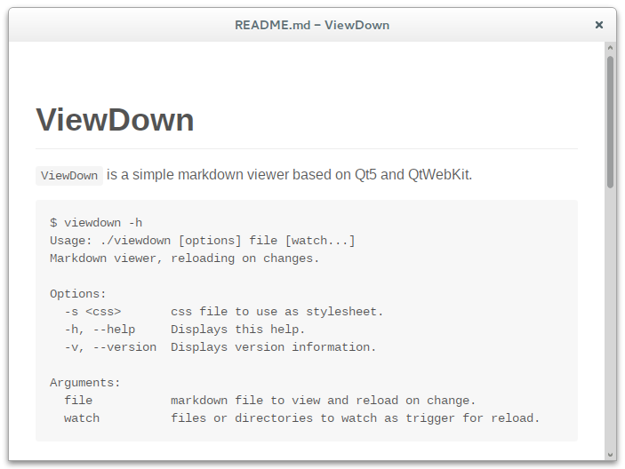

ViewDown
========

`ViewDown` is a simple markdown viewer based on Qt5 and QtWebKit.

	$ viewdown -h
	Usage: viewdown [options] file [watch...]
	Markdown viewer, reloading on changes.

	Options:
	  -s <css>       css file to use as stylesheet.
	  -h, --help     Displays this help.
	  -v, --version  Displays version information.

	Arguments:
	  file           markdown file to view and reload on change.
	  watch          files or directories to watch as trigger for reload.

Features
--------

* autoreload on file change
* open links in external browser
* default github style css
* watch additional files / directories as reload trigger
* clear cache on reload

|   Key  | Action         |
|:------:|:--------------:|
|   q    | close Window   |
|   r    | reload         |
|   o    | open file      |
|   i    | open inspector |
| Ctrl+p | print Page     |

Dependencies
------------

* Qt5
* QtWebKit
* hoedown (<https://github.com/hoedown/hoedown>)

Install
-------

#### Archlinux

Available in [AUR](https://aur.archlinux.org/packages/viewdown-git/)

	yaourt -S viewdown-git

#### From source

	qmake
	make
	./viewdown -h

License
-------

MIT License

`github.css` based on <https://github.com/sindresorhus/github-markdown-css>.

